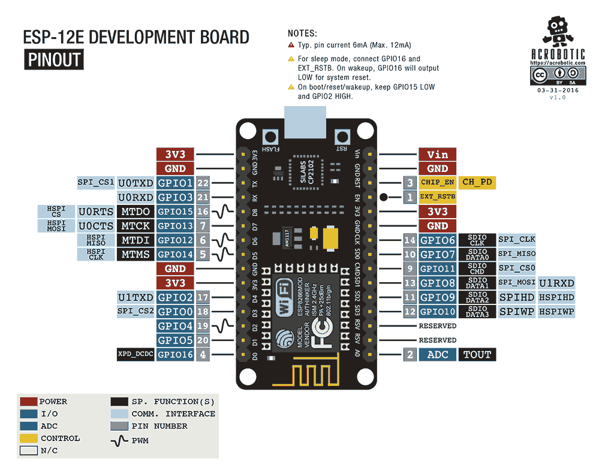
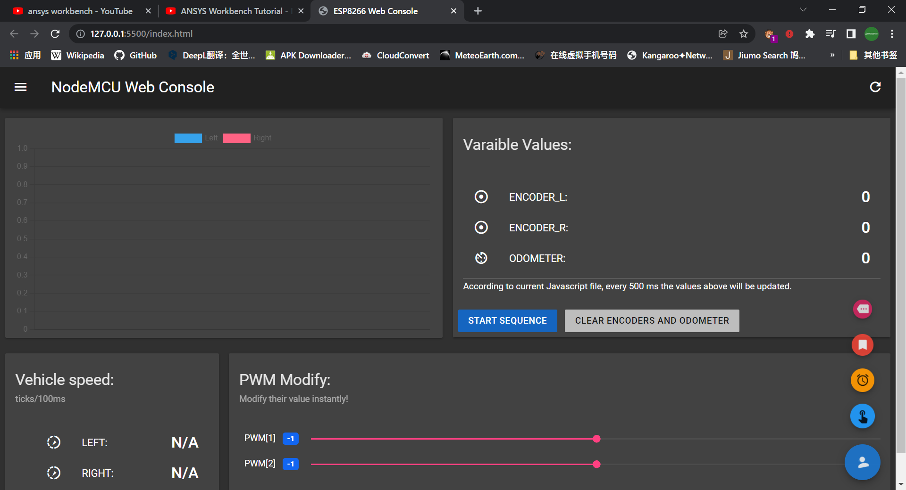

  

  <h1 align="center">英国机械工程师学会项目往复式小车源码</h1>

The source code of a reciprocating electronically controlled vehicles using NodeMCU for IMechE Test.

 

- Basic Design
  We choose to use ESP8266 as the microcontroller.

  

